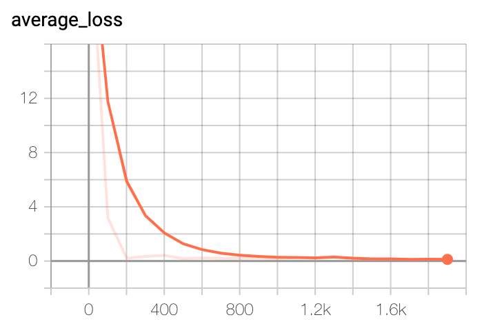

This project shows how to do linear regression using Tensorflow.

# Getting Started
## Installation
Install Python3 and pip3.

Run this command to verify Python3 is installed.

```
python3 --version
```

Install these packages:

```
pip3 install tensorflow
pip3 install pandas
pip3 install matplotlib
```

## Choosing an Editor
It is highly recommended that you use a modern editor like Visual Studio Code, Sublime Text and PyCharm.

Install Python development plugins for these editors.

## How to do the Workshop?
As you can already see completed solution code is already given to you in this repo. Use them only as a guide in case your own code is not working for some reason. You can also copy paste lengthy tedius code that serves no educational purpose.

Create a folder called **workshop/regression** anywhere suitable. Do all your work there.

> **Tip:** Make sure you understand every line of code that goes into your work. Blindy copying and pasting code from the completed solution won't help you in any way.


# Workshop - Tensorflow Basics
In this workshop we will learn these basic concepts of Tensorflow:

- **Placeholder** - This is where you supply values as input to a computation. For example when training a model you supply training data from files into placeholders.
- **Variable** - Tensorflow computes data and saves them in variables. For example if a model predicts the chance of rain that will be saved in a variable. Think of variables as computed outputs.
- **Computation graph** - All algebric operations are declared in a graph like data structure made up of operands and operators. Once a graph is created it can be executed anytime and any number of times. This is different from the way conventional programming languages like Java and C++ perform computation. There are tremendous benefits to graph based computation:
    - Some operations like matrix multiplication can be distributed to GPUs for massively parallel computation. You as a developer don't have to know anything about parallel computing or GPU programming.
    - Operations can be federated, meaning, they can be distributed across multiple machines over the network.
- **Matrix operations** - Linear algebra is at the heart of machine learning. Before we get into full scale ML problems we will learn how Tensorflow does basic matrix operations.

## Placeholder and Graph
Let's do one of the most basic algebric operations - adding two numbers.

Create a file called ``basic.py``.

Add these lines to import necessary package names.

```python
import numpy as np
import tensorflow as tf
```

Create two placeholders and declare a computation graph that adds these two numbers.

```python
a = tf.placeholder(tf.float32)
b = tf.placeholder(tf.float32)

graph = tf.add(a, b)
```

Now we are ready to execute the graph. Execution requires a Tensorflow session. Add these lines.

```python
with tf.Session() as sess:
    result = sess.run(graph, {a:10.0, b:20.0})

print("Result:", result)
```

Note how we are supplying the values for the placeholders using a dictionary. The keys in this dictionary must match the placeholder names.

Save the file.

Run the code like this.

```
python3 basic.py
```

You will see many deprecation warnings. You can ignore them. But make sure you see the result printed out.

```
Result: 30.0
```

Congratulations! You have successfully solved your first problem in Tensorflow. This may not seem like much. But when these operations are carried out in parallel in a gigantic scale you start to appreciate Tensorflow.

> **Did you know?** All participants in a graph, like placeholders, variables, and the graph itself is a ``tf.Tensor``. The result of running a graph may or may not be a tensor. In our example above the result is a simple ``float32``. 

## Variable
Variables are where results of computation can be saved. Let's model this operation that increments a variable.

```python
i = i + 1
```

You may recall from your CompSci 101 days that this is actually a combination of two operations:

- Add 1 to ``i`` and save the result in a temporary variable (created behind the scene by the compiler).
- Assign the result to the variable ``i``.

Let's create a graph that models this problem. At the bottom of ``basic.py`` add these lines.

```python
i = tf.Variable(0.0)
result = tf.add(i, 1)

graph = tf.assign(i, result)
```

Now we can execute the graph. Add these lines.

```python
with tf.Session() as sess:
    #initialize all variables
    sess.run(tf.global_variables_initializer())
    
    for step in range(5):
        sess.run(graph)

        print("Step:", step, "i:", sess.run(i))
```

A few things to note here.

- Even though we declared ``0.0`` as the initial value of ``i``, we still had to execute ``tf.global_variables_initializer()`` to initialize the variables. It is at this point ``0.0`` gets assigned to ``i``.
- To read the value of a variable you need to execute the variable as a graph. We are doing that here using ``sess.run(i)``.

Save and run the file. You should see this.

```
Step: 0 i: 1.0
Step: 1 i: 2.0
Step: 2 i: 3.0
Step: 3 i: 4.0
Step: 4 i: 5.0
```

>**Advanced:** You can think of variables as where we can store state in a lengthy series of operations. During training weights and biases are constantly updated for the most optimal outcome. As you can imagine weights and biases are always defined as variables in Tensorflow. These variables are computed only during the training phase. Their final values are saved in files at the end of training. During prediction phase their values are restored from files and assigned to the variables. This is why training takes so long - hours to weeks depending on the complexity of the model. Prediction can be done in the blink of an eye.
>
>Some advanced neural networks like RNN and LSTM need to maintain state even during the prediction phase. For example a model that translates language the meaning of a sentence can depend on the meaning of previous few sentences.

## Matrix Operation
Let's multiply a 4x2 matrix with a 2x4 matrix. The result should be a 4x4 matrix.

At the end of ``basic.py`` define the graph.

```python
X = tf.placeholder(tf.float32, [4, 2])
Y = tf.placeholder(tf.float32, [2, 4])

graph = tf.matmul(X, Y)
```

Note, this time we specified the dimensions (also called shape) of the input data.

Enter the input data.

```python
x_in = [
    [1, 2],
    [3, 4],
    [5, 6],
    [7, 8]
]
y_in = [
    [1, 2, 3, 4],
    [5, 6, 7, 8]
]
```

Finally execute the graph and display the result.

```python
with tf.Session() as sess:
    result = sess.run(graph, {X: x_in, Y: y_in})

print(result)
```

Save and run the file. Make sure you see this result.

```
[[11. 14. 17. 20.]
 [23. 30. 37. 44.]
 [35. 46. 57. 68.]
 [47. 62. 77. 92.]]
```

>**Numpy Array:** Here we are feeding plain Python lists to the placeholders. Tensorflow also allows feeding numpy arrays. In real life you will mostly work with numpy arrays.

Note: 

- As of Python 3.5 you can use the ``@`` operator for matrix multiplication. Example: ``X @ Y``. But I recommend you keep using ``tf.matmul()`` for better readability.
- To do elementwise multiplication of two matrices of same dimension you use ``tf.multiply(X, Y)`` or just the ``X * Y`` syntax.

### Unknown Dimensions
In the code above we have precisely stated the matrix dimensions as 4x2 and 2x4. In real life there will be some dimensions that you will not know when writing the code. For example, you may not know how many sample data are available in the training dataset. Tensorflow is very flexible in this regard. You can use ``None`` as the dimension in those cases. At execution time Tensorflow will make sure that the actual dimensions of the data fed to the model are valid for the requested matrix operation.

Change the way ``X`` and ``Y`` placeholders are defined.

```python
X = tf.placeholder(tf.float32, [None, 2])
Y = tf.placeholder(tf.float32, [2, None])
```

Now at execution time the missing dimensions will be filled in based on the data that is fed to the model.

Save and run the file. You should see the same result.

# Workshop - Simple Linear Regression
In linear regression a system learns weights and bias from training data such that it can fit a line through the data most accurately. Using this technique you can solve problems like housing price prediction.

During training error (or loss) is gradually minimized using a technique called Gradient Descent.

Linear regression may be one of the simplest ML techniques but it forms the foundation for other learning algorithms. This is why we need to spend a bit of time fully understanding how this works.

In this workshop we will solve a very simple problem. We will train the system using test data that we know follows this equation.

```
y = 3x + 4
```

At the end of training the model should discover that the weight is 3.0 and bias is 4.0.

In this example prediction (or label) ``y`` depends on a single feature ``x``. For example, price of a house depends on the square footage. In real life prediction may depend on dozens of features.

We keep the problem purposely simple. The focus of this workshop is:

- How to run training that discovers the weights and biases for least error.
- How to run prediction
- How to save and restore weights and biases
- Accurately understand the dimensions of each matrix used in the model

## Define the Model
Create a file called ``simple-regression.py``.

Add these import statements.

```python
import tensorflow.compat.v1 as tf
import numpy as np
```

Weight is a ``nx1`` vector where ``n`` is the number of features in a problem. That is, a weight exists for every feature. We have a single feature only. Let's declare it as a ``1x1`` matrix.

```python
# Weight as 1x1 matrix initialized to 0
W = tf.Variable([[0.0]])
```

Bias is just a single (scalar) variable in linear regression.

```python
b = tf.Variable(0.0)
```

Next, declare the input placeholders. Feature matrix ``X`` has dimension of ``mxn`` where ``m`` is the number of training samples (not known when writing code) and ``n`` is the number of features. Prediction ``Y`` is always ``mx1`` in linear regression (one predicted value for each sample data).

```python
X = tf.placeholder(tf.float32, [None, 1])
Y = tf.placeholder(tf.float32, [None, 1])
```

Finally, declare the model like this.

```python
predictions = tf.add(tf.matmul(X, W), b)
loss = tf.reduce_mean(tf.square(predictions - Y))
model = tf.train.GradientDescentOptimizer(0.001).minimize(loss)
```

>**Crosscheck:** Audit the dimensions of ``X`` and ``W``. Can they be legally multiplied? What will be the dimension of ``predictions``?

## Generate Training Data
Normally training data is loaded from disk. But in our simple example we can just generate it. Add these lines.

```python
# Sample imput data. y = 3x + 4
train_x = np.array([[1.0], [2.0], [3.0], [4.0]])
train_y = train_x * 3.0 + 4.0
```

We will feed ``train_x`` to ``X`` and ``train_y`` to ``Y``. Verify that their dimensions match up.

## Training and Prediction
Add this code.

```python
with tf.Session() as sess:
    sess.run(tf.global_variables_initializer())

    for train_step in range(40001):
        sess.run(model, {X:train_x, Y:train_y})

        # Print training progress
        if train_step % 2000 == 0:
            error_rate = sess.run(loss, {X:train_x, Y:train_y})
    
            print("Step:", train_step, 
                "W:", sess.run(W), 
                "b:", sess.run(b), 
                "Loss:", error_rate)
            if error_rate < 0.0001:
                break

    # Validate the model with data not used in training
    x_unseen = np.array([[6.0], [7.0], [8.0]])
    y_expected = x_unseen * 3.0 + 4.0
    print("Predections:", sess.run(predictions, {X:x_unseen}))
    print("Expected:", y_expected)
```

Everytime we run the model the weights and bias are slighltly updated. Generally, with every update the accuracy goes up and error starts to drop.

## Run Code
Save your file and run it like this.

```
python3 simple-regression.py
```

Note as training progresses the weight and bias converge on 3 and 4 respectively. Also verify that prediction on unseen data is very close to what is expected.

## Separate Training and Prediction Phases
Right now our code is running training and prediction in the same Tensorflow session. That is not how things work in real life. Training can take hours to days depending on how complex the model is and how much training data you have. Prediction is actually used by the end user perhaps from a web site or a microservice. Code for these two phases are developed and deployed independently. 

Basic steps to separate these two phases go like this:

- At the end of training save the weights and biases (collectively called parameters) to disk.
- During prediction these weights and biases are loaded from disk. Variables are initialized with these values. As a result, these parameter files need to be deployed to production along with the prediction code.

Below the line:

```python
with tf.Session() as sess:
```

Add:

```python
saver = tf.train.Saver()
```

Save the parameters when training is done.

```python
if error_rate < 0.0001:
    saver.save(sess, "./model.ckpt")

    break
```

Move the prediction code in its own separate session scope.

```python
with tf.Session() as sess:
    saver = tf.train.Saver()
    sess.run(tf.global_variables_initializer())

    # Load the weights and biases
    saver.restore(sess, "./model.ckpt")

    # Validate the model with data not used in training
    x_unseen = np.array([[6.0], [7.0], [8.0]])
    y_expected = x_unseen * 3.0 + 4.0
    print("Predections:", sess.run(predictions, {X:x_unseen}))
    print("Expected:", y_expected)
```

Save file and run it. The result will be the same as before. Verify that you have several ``model.ckpt.*`` files in the current folder.

>**Tip:** During prediction we only need to use the ``predictions`` node of the graph. The ``loss`` and ``model`` nodes are not useful during prediction. In any case, much of the graph definition code is shared by the training and prediction phases. As a result you need to find a way to isolate this code in a reusable file. It is also possible that the prediction phase is coded using a different programming language. For example, if the end user web site is created using Java you will need to re-write the graph creation code using Java.

# Workshop - AirBnB Property Price Prediction
We will now use linear regression to solve a real life problem using real life data. We have the AirBnB property rental price data for the Boston, MA area. There are dozens of features that prices depend on. We will train a model to learn from the data and start to do fairly accurate prediction of prices.

We will follow several real life project best practices:

- **Prepare data** - Clean up missing data. Format data suitable for training.
- **Categorical features** - Not all features are numerical. We have categorical features. For example property type values can be "House", "Apartment", "Boat" etc. We need to learn how to deal with these.
- **Train/test split** - Separate data into two parts. 80% will be used for training. The remaining 20% of unseen data will be used for validation.
- **Distinct phases** - We will have separate code for train, test and prediction. They will share model creation code.

## Preparing Data
This repo contains AirBnb data for Boston in ``listings.csv``. This was downloaded from: http://insideairbnb.com/get-the-data.html.

Although there are many features in this file we decided to only use these features. Open the file in Excel and briefly check each feature.

- **property_type** - Categorical 
- **room_type** - Categorical 
- **bathrooms** - Numerical but sometimes missing
- **bedrooms** - Numerical but sometimes missing
- **beds** - Numerical but sometimes missing
- **bed_type** - Categorical
- **accommodates** - Numerical
- **host_total_listings_count** - Numerical
- **number_of_reviews** - Numerical
- **review_scores_value** - Numerical but sometimes missing
- **neighbourhood_cleansed** - Categorical. Example: "Jamaica Plain" and "West Roxbury".
- **cleaning_fee** - Given as a string like $12.34. Need conversion to numeric 
- **minimum_nights** - Numerical
- **security_deposit** - Given as a string like $12.34. Need conversion to numeric 
- **host_is_superhost** - Categorical. t for true and f for false
- **instant_bookable** - Categorical. t for true and f for false
- **price** - This is the label column. Given as a string like $12.34. Need conversion to numeric

The amount of pre-processing we have to do is extensive. This is something we should do as a separate phase and before training can even begin. To save time the data processing code is given to you in ``airbnb-prepare-data.py``. Instructor should walk through every line of code and explain.

>**Vocabulary:** Vocabulary for a categorical feature is the complete list of possible values. For example, for ``instant_bookable`` the vocabulary is ``["t", "f"]``. Tensorflow provides many ways of dealing with categorical features. Vocabulary based approach is one of the easiest to understand and work with.
>
>Here we extract the vocabulary for every categorical feature and save them in a Pickl file. During training will load the vocabulary from there.
>
>If the vocabulary changes you will need to retrain the model.

Run the code to prepare data.

```
python3 airbnb-prepare-data.py
```

This will output the following files.

- train_price.csv - Log value of prices used for training
- train_features.csv - Features used for training
- test_price.csv - Log value of prices used for testing
- test_features.csv - Features used for testing

Copy these files to your **workshop/regression** folder.

## Create the Model
In the previous workshop we implemented linear regression using low level Tensorflow API. Tensorflow has recently added the estimator API that is not only super easy to use (easier than even Keras) it also supports many very powerful features:

- Makes it easy to work with categorical features
- Supports fully distributed training involving multiple machines
- Parameters are saved in checkpoint files during training. They are automatically loaded during testing and prediction
- You can observe training progress and do other debugging using Tensorboard

All of these make estimators compelling alternative to low level Tensorflow API and Keras. Not only for proof of concept but also for production use.

In this workshop we will use the pre-built estimator called ``tf.estimator.LinearRegressor``.

In your **workshop/regression** folder create a file called ``model.py``. Import these names.

```python
import tensorflow.compat.v1 as tf
import pickle
```

Define a function called ``build_model()``.

```python
def build_model():
    #Code goes here
```

Eastimators expect each feature to be represented by a feature column. A feature column can be numeric like average review score. Or it can be categorical. Numeric columns are always easy to work with. Let's go ahead and create these columns. Add these lines to the function.

```python
def build_model():
    # Define the numeric feature columns
    numeric_features = [
        'host_total_listings_count', 'accommodates', 'bathrooms', 'bedrooms',
        'beds', 'security_deposit', 'cleaning_fee', 'minimum_nights',
        'number_of_reviews', 'review_scores_value'
    ]

    numeric_columns = [
        tf.feature_column.numeric_column(key=feature)
        for feature in numeric_features
    ]

```

Next create the category columns using the vocabulary based approach.

```python
    # Define the category feature columns
    categorical_features = [
        'host_is_superhost', 'neighbourhood_cleansed', 'property_type',
        'room_type', 'bed_type', 'instant_bookable'
    ]

    # Load vocabulary of category features
    with open("vocabulary.pkl", "rb") as f:
        vocabulary = pickle.load(f)

    categorical_columns = [
        tf.feature_column.categorical_column_with_vocabulary_list(
            key=feature, vocabulary_list=vocabulary[feature])
        for feature in categorical_features
    ]

```

Collect all columns in a single list.

```python
    all_columns = numeric_columns + categorical_columns
```

Finally create the estimator and return it from the function.

```python
    linear_regressor = tf.estimator.LinearRegressor(
        feature_columns=all_columns, model_dir="linear_regressor")

    return linear_regressor
```

Here ``model_dir`` points to the folder where:

- Parameters will be saved in checkpoint files.
- Tensorboard logging will take place

> Pandas and feature columns work very well together. Each feature column has a unique key name. This should match the column names in pandas DataFrame. During training we can feed an entire DataFrame to the estimator. We shall see this in action next.

Save your file before moving forward.

## Do Training
Create a file called ``train.py``. Add these imports.

```python
import pandas as pd
import tensorflow.compat.v1 as tf
import model
```

Add the following function.

```python
def train_model():
    # Code goes here
```

Create the model.

```python
def train_model():
    linear_regressor = model.build_model()
```

Load training data using pandas.

```python
    train_features = pd.read_csv("train_features.csv")
    train_prices = pd.read_csv("train_price.csv")
```

Both of these will be ``DataFrame`` objects.

During training an estimator needs an input function. Job of this input function is to feed the feature and label placeholders with data in batches. You can write your own function. But fortunately for us Tensorflow has a built in function that can feed the model with pandas data. Since features are multi-column we can feed an entire ``DataFrame``. The labels are a single column. This must be a pandas ``Series``. Add this code to define the function.

```python
    training_input_fn = tf.estimator.inputs.pandas_input_fn(
        x=train_features,
        y=train_prices["price"],
        batch_size=32,
        shuffle=True,
        num_epochs=100)
```

Notice how we extracted the price ``Series`` from the ``train_prices``. 

> **Batch size** signifies how many samples are fed during a training step. After every step weights and biases are corrected.
>
> **Number of epoch** signifies how many times the entire dataset is repeated. For each epoch batches of data are fed until the entire dataset is exhausted. Then the process starts again and repeated for the number of epochs.

Next ask the estimator to start training.

```python
    linear_regressor.train(input_fn = training_input_fn,steps=2000)
```

We are done with training code. Call the function from the bottom of the file.

```python
train_model()
```

Save your file. Then run it.

```
python3 train.py
```

It will take a few moments but finally finish.

## Observe Loss Using Tensorboard
Start Tensorboard by pointing to the folder where logging is done.

```
tensorboard --logdir=linear_regressor
```

Open a browser and enter ``http://localhost:6006``.



Check the average_loss plot. It shows loss has gone down steadily and nicely. This is a classic shape for a good quality training.

End tensorboard by hittong **Control+C**.

## Validate the Model
We will now run predictions on data withheld from training. We know the correct prices for these samples. We can easily compare the predicted prices with the actual prices and compute accuracy.

Create a file called ``evaluate.py``. Add the following code.

```python
import pandas as pd
import tensorflow.compat.v1 as tf
import model

def evaluate_model():
    linear_regressor = model.build_model()
    test_features = pd.read_csv("test_features.csv")
    test_prices = pd.read_csv("test_price.csv")

    eval_input_fn = tf.estimator.inputs.pandas_input_fn(
        x=test_features,
        y=test_prices["price"],
        batch_size=32,
        shuffle=False,
        num_epochs=1)
    result = linear_regressor.evaluate(input_fn = eval_input_fn)
    print(result)

evaluate_model()
```

This is very similar to the training code. Two key differences:

- We set the number of epochs to 1. There is no sense in repeating validation more than once.
- We call the ``evaluate()`` method of the estimator. This returns a result as a dictionary.

Save the file and run it.

```
python3 evaluate.py
```

You will see something similar to this.

```
{'average_loss': 0.15383671, 'label/mean': 5.011344, 'loss': 4.8458567, 'prediction/mean': 5.0486903, 'global_step': 2000}
```

Log of prices are typically in the range of 4 to 6. You can actually see that in the mean price shown by ``label/mean``. For that an average loss of 0.15 is not terribly good. But strangely the mean value of the predicted prices is very close to mean value of the actual prices.

## Run Predictions
We will now learn how to predict prices given a set of input features. We will use the test features for this. In real life this code will be built in a web site or a microservice.

Create a file called ``predict.py``. Add this code.

```python
import tensorflow.compat.v1 as tf
import numpy as np
import model

def predict():
    linear_regressor = model.build_model()
    test_features = pd.read_csv("test_features.csv")
    test_prices = pd.read_csv("test_price.csv")

    predict_input_fn = tf.estimator.inputs.pandas_input_fn(
        x=test_features,
        y=None,
        batch_size=32,
        shuffle=False,
        num_epochs=1)
    results = linear_regressor.predict(input_fn = predict_input_fn)
        
    # Collect predictions in a list
    predictions = [r["predictions"][0] for r in results]

    for price in zip(predictions, test_prices.values):
        print("Predicted:", price[0], "Actual:", price[1][0])

predict()
```

The ``predict()`` method returns a generator which can be iyerated using ``for``. For each set of features there is one prediction. Every prediction is represented by a dictionary where the actual predicted value is saved using the key ``predictions``.

Save and run the file.